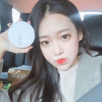
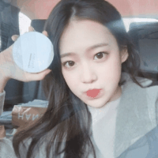

# Instruction
* The project came from github, on the original basis, I added the image synthesis, image transfer GIF function, And I've annotated some of the functions.

* This project includes two landmark-based algorithms about face morphing.

# example
Given two images   

    

and   

    

We can get the result as   
    

# dependencies
dlib, opencv and numpy